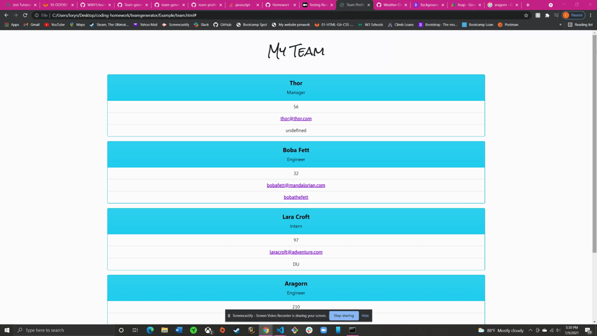
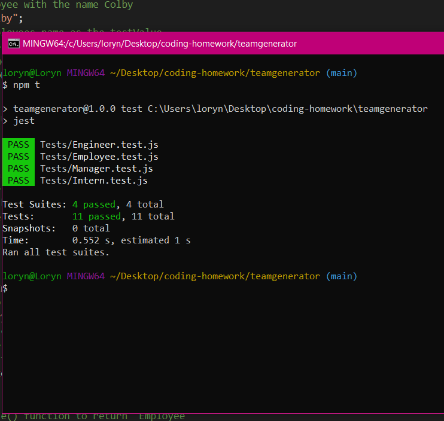

# Team Generator 
An app that uses Node.js to create an HTML webpage containing information about employees. The user is asked in their terminal to answer a series of questions regarding their employees, management, and different roles (engineer and interns); the information they input is then taken and created into an HTML webpage to display all the information! 

# Technologies Used
* Node.js
* Inquirer
* Jest for tests

# How to Use App
* Install node.js and inquirer packages (npm i inquirer)
* In terminal, node app.js will start the process
* Answer the questions shown on the terminal 
* When done an HTML will be created and your generated team webpage is ready!

# Example 
## Youtube 
https://youtu.be/Fu_h9qVbAYc
## Google Drive 
https://drive.google.com/file/d/18rEycyKhBCavxV8tnwYB9SJ8BpC3Kh7F/view?usp=sharing

# Tests

